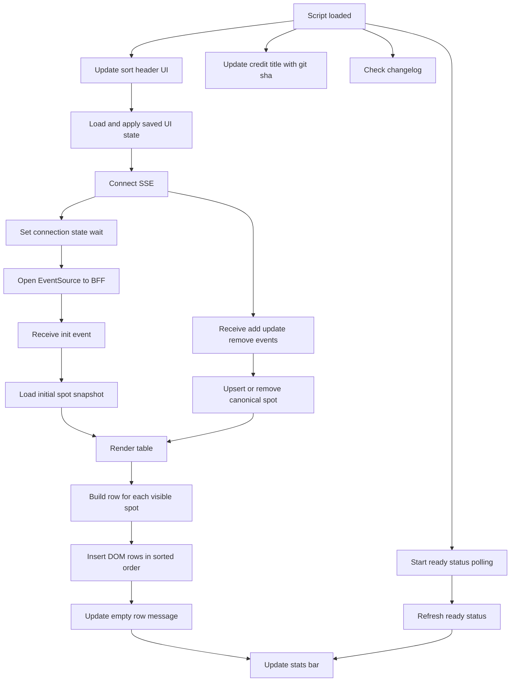

# How this Web UI works

This document explains the boot sequence and UI paint pipeline in `js/app.js`.
  

## Boot sequence (latest 6 lines)

`app.js` boots in this exact order:

1. `updateSortHeaderUi()`
2. `applyUiState(loadUiState())`
3. `connect()`
4. `startReadyStatusPolling()`
5. `updateCreditTitleWithGitSha()`
6. `checkChangelog()`

This order guarantees that sort/filter/search UI state is applied before live SSE data starts painting rows.

## Detailed procedure to boot and paint the Web UI

1. `updateSortHeaderUi()` synchronizes sortable table header classes with `tableState` so the active sort arrow is correct before data appears.
2. `loadUiState()` reads persisted filter/sort/search state from localStorage.
3. `applyUiState(...)` copies that state into runtime objects (`filters`, `tableState`) and updates bound controls in the DOM.
4. `connect()` starts the EventSource connection to the BFF stream endpoint.
5. `connect()` immediately sets connection status to `wait` (connecting) and registers handlers for `init`, `add`, `update`, and `remove`.
6. When `init` arrives, `loadInit(spotList)` clears old state and rebuilds canonical operation rows in `spots`.
7. `loadInit` calls `renderTable()`, `updateEmptyRow()`, and `updateStats()` to produce the first full paint.
8. `renderTable()` removes existing rendered rows, sorts all canonical spots, filters visibility, and appends new rows through `buildRow(...)`.
9. `enforceSortedDomOrder()` runs after render to guarantee DOM row order matches the active comparator.
10. For ongoing live traffic, `add` and `update` call `upsertOperationSpot(...)`; `remove` calls `removeRawSpot(...)`.
11. Each live update path ends with `renderTable()`, `updateEmptyRow()`, and `updateStats()`, so the UI always reflects canonical state after every event.
12. `startReadyStatusPolling()` begins periodic `/ready` fetches that refresh users/sessions presence shown in the stats bar.
13. `updateCreditTitleWithGitSha()` fetches the latest GitHub commit SHA and updates the title suffix when available.
14. `checkChangelog()` fetches `Changelog.md` and renders a modal if a newer unseen changelog date exists.

## Paint rules

- The canonical source of truth is the `spots` map keyed by logical operation identity.
- Every full paint is driven from canonical data, then filtered and sorted.
- Empty-state messaging is computed after each paint.
- Stats are recomputed from currently visible rows after each paint.
- Row flash effects (`flash-new`, `flash-upd`) are applied after render for live event visibility.
